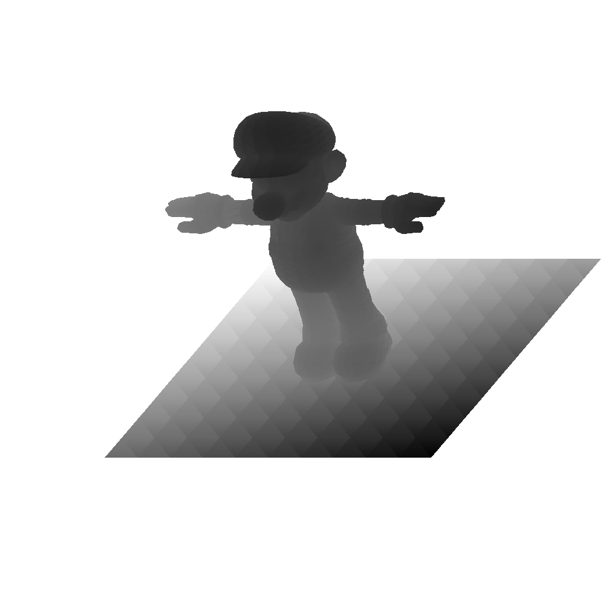

<figure>
  <video controls width="800" loading="lazy">
    <source src="/videos/rasterizer.mp4" type="video/mp4">
  </video>
  <figcaption>4x anti-aliasing used here</figcaption>
</figure>

## About

I made this C++ rasterizer with OBJ importing, Lambert shading, distance fog, 16x anti-aliasing, and shadow mapping.

