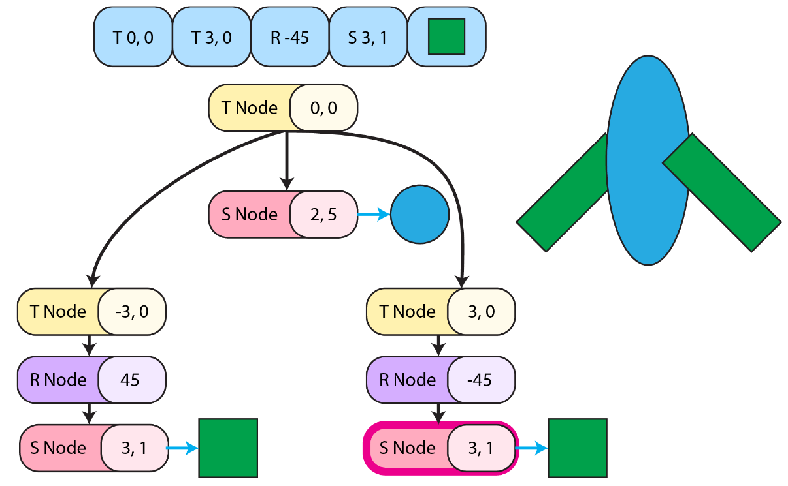

<video controls width="800" loading="lazy">
  <source src="/videos/scenegraph.mp4" type="video/mp4">
</video>

## About

My creation for the scene graph assignment for CIS 4600 (intro to graphics). 

### What is a scene graph?
A scene graph is a set of nodes that hold transformation matrix data and pointers to other nodes and geometry. Traverse a directed tree of transformations to render shapes.




### Implementation
The joint angles are set procedurally using sin and cos functions offset by their rotation around the center pivot.

After much experimentation, theses are the numbers I came up with that create a decent walk cycle.

```cpp
"""
This code is iterated N times in a for loop
"""

// root
float time = 1.f / N * i;
float pivot_angle = 2.f * PI * time;

// Controllers

// arms
float u_arm_angle = PI / 8.f * sin(time * 2 * PI);
float l_arm_angle1 = PI / 16.f * (sin(time * 2 * PI + PI / 4.f - PI) - 1);
float l_arm_angle2 = PI / 16.f * (sin(time * 2 * PI + PI / 4.f) - 1);

float uArm_ang1 = -PI / 2.f + u_arm_angle;
float lArm_ang1 = -l_arm_angle1;

float uArm_ang2 = -PI / 2.f - u_arm_angle;
float lArm_ang2 = -l_arm_angle2;

// legs
float u_leg_angle = PI / 6.f * cos(time * 2 * PI + 2 * PI / 6.f);
float l_leg_angle = PI / 12.f * (cos(time * 4 * PI + 3 * PI / 6.f) - 1.2f);

float uLeg_ang1 = -PI / 1.8f + PI / 8.f + u_leg_angle;
float lLeg_ang1 = l_leg_angle;

float uLeg_ang2 = -PI / 1.8f + PI / 8.f - u_leg_angle;
float lLeg_ang2 = l_leg_angle;

// body/head
float body_offset = 0.1f * cos(time * 4 * PI);
float head_offset = 0.02f * cos(time * 4 * PI + PI / 12);

float body_Offy = body_offset;
float head_Offy = head_offset;
```
