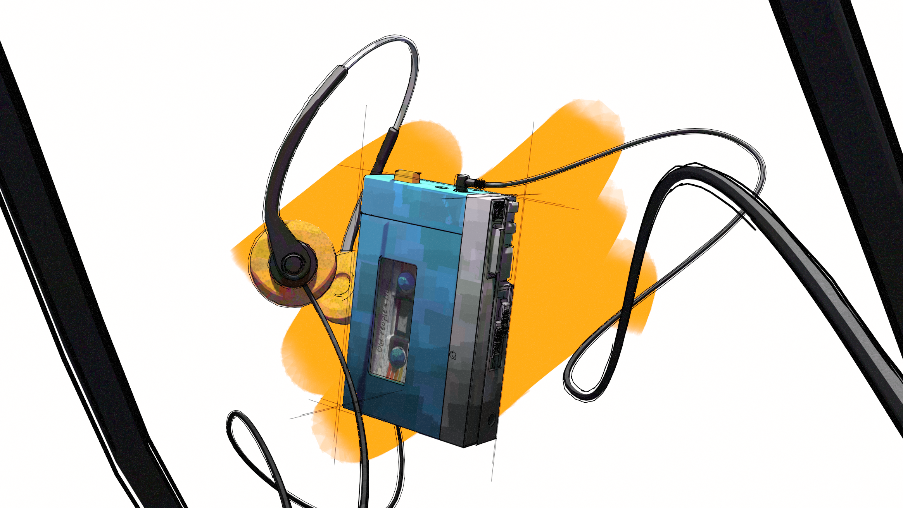

## Render

## About

Inspired by Fernando Correa's art style, I modeled, textured, and lined this 3D piece. To emphasize depth and composition, I used the cable to introduce foreground elements that frame the main subject and guide the viewer's eye. My favorite part of this project was creating the procedural painterly shader for the Walkman player.

This is WIP.